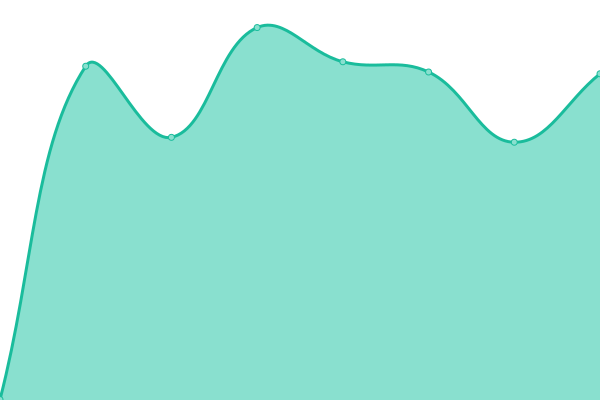

# [📈 Live Status](https://uptime.seven-retail.com): <!--live status--> **🟧 Partial outage**

This repository contains the open-source uptime monitor and status page for [SEVEN Retail](https://seven-retail.com/), powered by [Upptime](https://github.com/upptime/upptime).

With [Upptime](https://upptime.js.org), you can get your own unlimited and free uptime monitor and status page, powered entirely by a GitHub repository. We use [Issues](https://github.com/seven-retail/uptime-monitor/issues) as incident reports, [Actions](https://github.com/seven-retail/uptime-monitor/actions) as uptime monitors, and [Pages](https://uptime.seven-retail.com) for the status page.

<!--start: status pages-->
<!-- This summary is generated by Upptime (https://github.com/upptime/upptime) -->
<!-- Do not edit this manually, your changes will be overwritten -->
<!-- prettier-ignore -->
| URL | Status | History | Response Time | Uptime |
| --- | ------ | ------- | ------------- | ------ |
|  Golden Hotpot & Grill's Promotion Website | 🟩 Up | [golden-hotpot-and-grill-s-promotion-website.yml](https://github.com/seven-retail/uptime-monitor/commits/HEAD/history/golden-hotpot-and-grill-s-promotion-website.yml) | 

 1991ms
     
 | 

<a href="https://uptime.seven-retail.com/history/golden-hotpot-and-grill-s-promotion-website">99.83%</a>
    

|  Golden Lamian's Promotion Website | 🟥 Down | [golden-lamian-s-promotion-website.yml](https://github.com/seven-retail/uptime-monitor/commits/HEAD/history/golden-lamian-s-promotion-website.yml) | 

 1206ms
     
 | 

<a href="https://uptime.seven-retail.com/history/golden-lamian-s-promotion-website">99.60%</a>
    

|  Seven Retail's API | 🟩 Up | [seven-retail-s-api.yml](https://github.com/seven-retail/uptime-monitor/commits/HEAD/history/seven-retail-s-api.yml) | 

 731ms
     
 | 

<a href="https://uptime.seven-retail.com/history/seven-retail-s-api">100.00%</a>
    

|  Seven Retail's Content Management System | 🟩 Up | [seven-retail-s-content-management-system.yml](https://github.com/seven-retail/uptime-monitor/commits/HEAD/history/seven-retail-s-content-management-system.yml) | 

 727ms
     
 | 

<a href="https://uptime.seven-retail.com/history/seven-retail-s-content-management-system">100.00%</a>
    

<!--end: status pages-->

[**Visit our status website →**](https://uptime.seven-retail.com)

## 📄 License

- Powered by: [Upptime](https://github.com/upptime/upptime)
- Code: [MIT](./LICENSE) © [Anand Chowdhary](https://anandchowdhary.com), supported by [Pabio](https://pabio.com)
- Data in the `./history` directory: [Open Database License](https://opendatacommons.org/licenses/odbl/1-0/)
